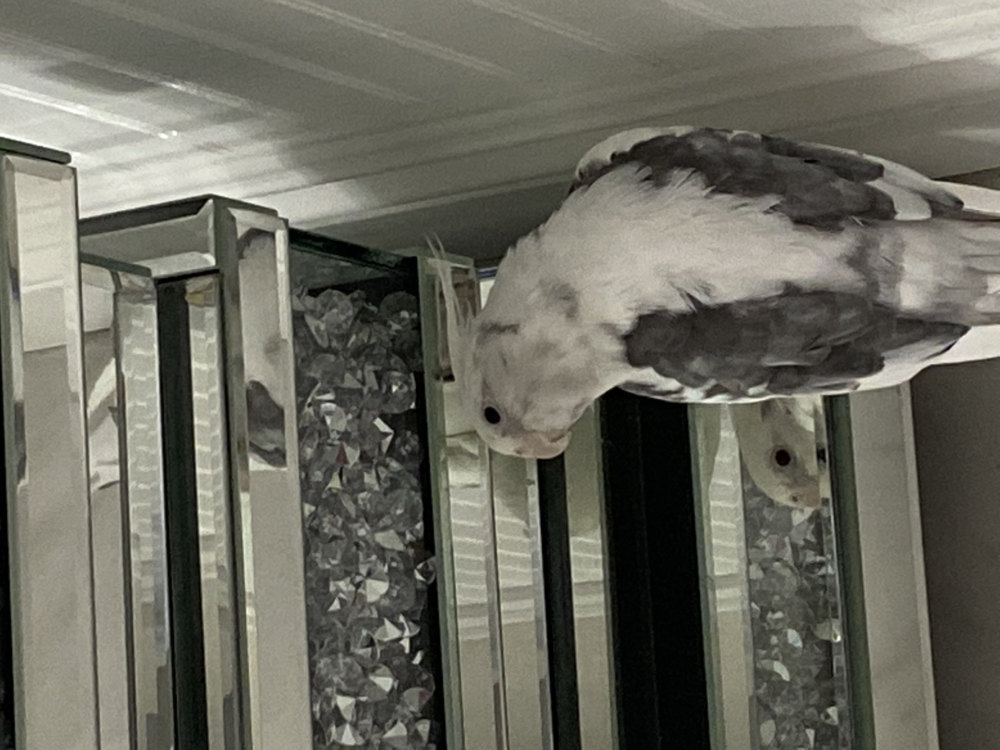
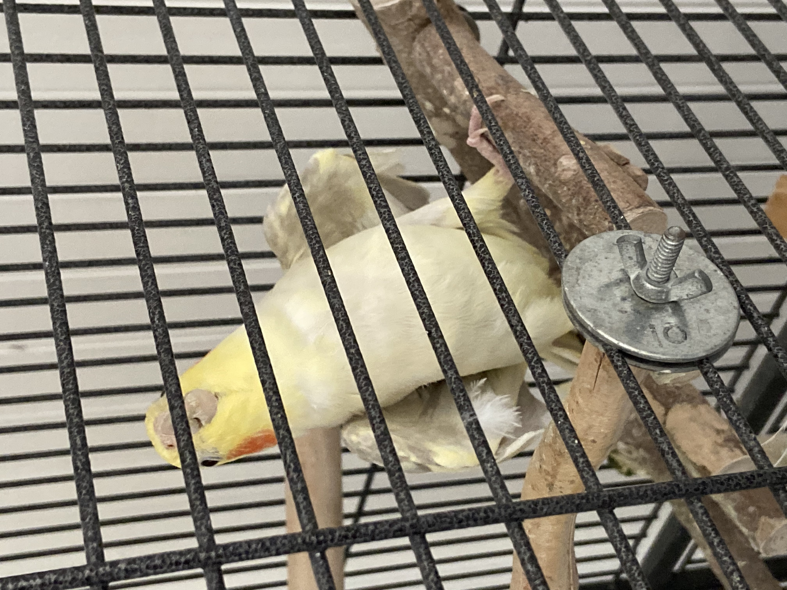

# Loreen Samaan's User Page

## Quick Navigation

Quick Navigation:

1. [Who I Am](#who-i-am)

2. [My Work](#my-work)

3. [Some of my favorite projects](#some-of-my-favorite-projects)

4. [More about me](#more-about-me)

---

**Who I am:** Hi! I'm Loreen, a Senior at UCSD majoring in General Biology and minoring in Computer Science. I'm really interested in **bioinformatics**, so I spend a huge chunk of my time solving biological problems using code. My primary coding language for these projects is **Python** because I love the syntax and how flexible it is. I dont have much experience with front-end development, so I've been getting into that with my recent projects. I really enjoy writing programs and hope to learn more about Software Engineering!

Juggling coursework for two different subjects can get difficult, but I really do enjoy it! Here is a quote that I find to be very inspiring:
> *"If you can dream it, you can do it."* - Walt Disney

To match the quote, here is a photo of me on the right matching disney fits with my best friend!

[Click here to view the photo.](./me.jpg)

***

### **My Work:** 

Here is a brief example of what bioinformatics entails:

```python
def get_hamming_distance(p: str, q: str) -> int:
    #Calculate the Hamming distance between two strings.
    hamming_distance = 0
    for i in range(len(p)):
        if p[i] != q[i]:
            hamming_distance += 1
    return hamming_distance
```

Here's a simple Python bioinformatics algorithm that finds the Hamming distance between two DNA sequences. The Hamming distance is the number of positions at which the corresponding symbols are different in two sequences of equal length. This is very useful for things such as:
- mutation analysis 
- error detection
- sequence alignments

### Some of my favorite projects:
1. Global and Local Sequence Alignments
2. Terminal Portfolio
3. Writing my own Programming Language (work-in-progress)

I have also done a lot of bioinformatics data analysis and visualization in R. Here is my page containing some of my labwork: [Bioinformatics Lab Work!](https://ltsamaan.github.io/bimm143/)
   
***

### **More about me:** 

Something I love to share about myself is I have been a bird owner for about **15 years**! I currently have two pet Australian cockatiels named Whitey and Belle. 

Here are some photos:


**Cool Facts About Whitey:**

- He is 13 years old.
- His brithday is October 14th.
- He loves to sit by people. 
- He waddles when he walks and prefers it over flying.

---
  

**Cool Facts About Belle:**

- 1 year old.
- Obsessed with her reflection in the mirror.
- Might be a boy.
- Loves to sing at 2 a.m.